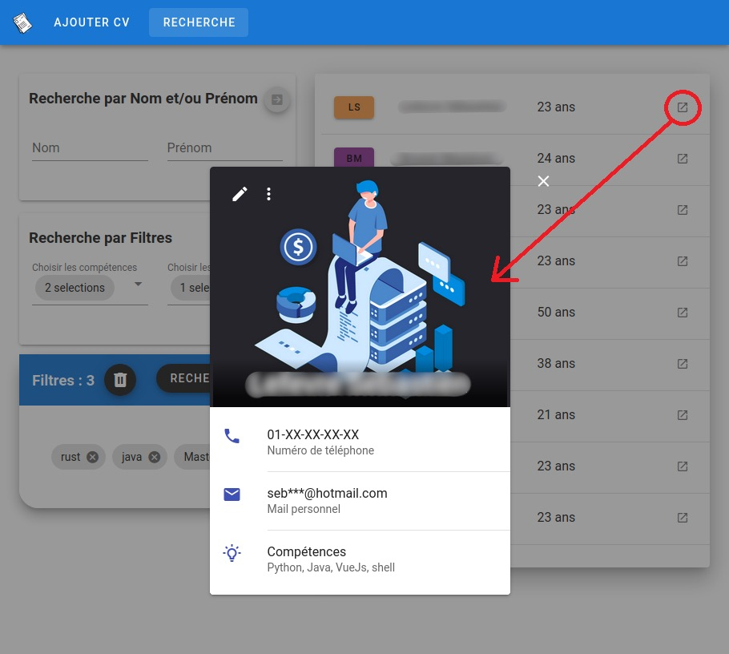

# Daar_Projet3

Projet d'indexation des CVs dans Elasticsearch

## Installation du back

- Elasticsearch 7.10.0 : 

 https://www.elastic.co/fr/downloads/elasticsearch

- (facultatif) Kibana 7.10.0 :

 https://www.elastic.co/fr/downloads/kibana

- Java 1.8

- IntelliJ ultimate (gratuit avec le mail de la fac) ou la version classique

- (facultatif) Postman pour visualiser les appels à l'API

- Lancer les services :

        systemctl start elasticsearch.service
        
        systemctl start kibana.service

  ou pour *macOs*

        brew services start elasticsearch-full
    
        brew services start kibana-full

- Importer le projet dans *intelliJ*

### Dans IntelliJ :

- Parametrage du SDK :

    Aller dans **Open Modules Settings** puis dans l'onglet *projet* le sdk en java 1.8 
(verifier l'onglet SDK possède bien que le java 1.8)

- Installation de lombok :

    Dans les préferences du logiciel, aller dans l'onglet plugins et installer **lombok**

### Fonctionnement

Pour lancer l'application, exectuer le fichier **Projet3Application**

Les fichiers de test permettent de vous rendre compte du fonctionnement

(lancez le saveTest et sur kibana vous devriez pouvoir trouver les infos du cv enregistré)

### Kibana

Acces à kibana : 

 http://localhost:5601/

Une fois dessus il faut créer un index patern pour les CV

Ensuite il est possible de créer un vizualiser pour voir les données

## Installation du front

- Se rendre dans le repertoire front/appvue et lancer : 
  
        npm install
    puis
    
        npm run serve -- --port 8081
    
    Le port spécifié permet de ne pas lancer le front sur le même port que le back
    

Le site est donc accessible sur :

 http://localhost:8081

---

## Présentation du front 

#### Ajout de CV

|           Formulaire à remplir            |            Formulaire accepté             |
| :---------------------------------------: | :---------------------------------------: |
|  |  |

- Tous les champs doivent etre remplis et doivent respecter leur conditions respectives.
- Le boutton envoyer ne sera disponible qu'une fois toutes les conditions réunies.
- Une notification via une snackbar indique la bonne réception ou non du CV coté back.

### Recherche de profils

|              Recherche par filtrage               |           Recherche par nom et ou prénom            |
| :-----------------------------------------------: | :-------------------------------------------------: |
|  |  |

#### Deux types de recherche:

- La recherche par Nom ou Prénom, ou les deux en meme temps.
- Recherche par filtre permet de selectionner via plusieurs catégories un ensemble de filtre à appliquer à la recherche.

### Affichage des profils

|                                                              |
| :----------------------------------------------------------: |
| L'affichage des profils se réalise via le resultat de la recherche précédente. Il permet de montrer plus de détail le profil selectionné. |

